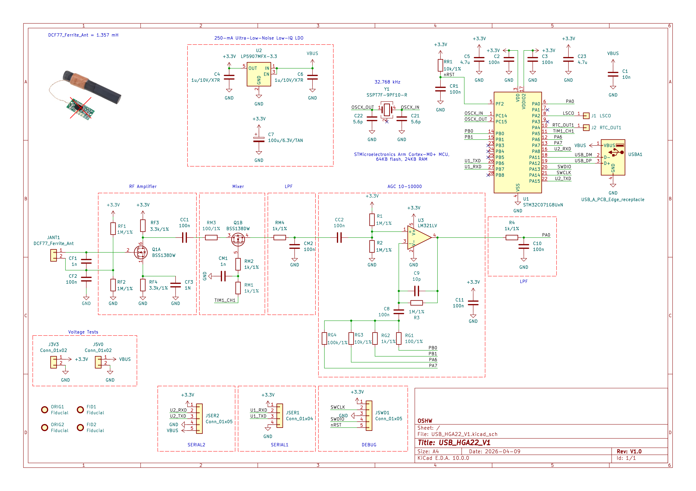
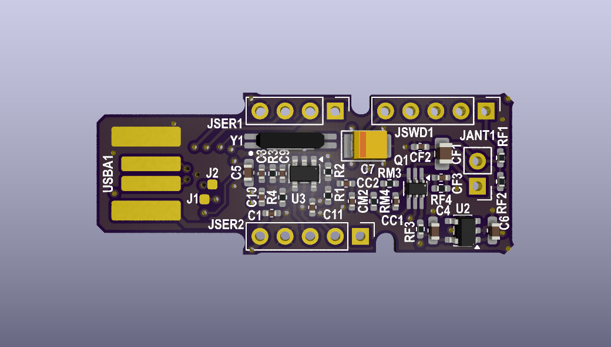
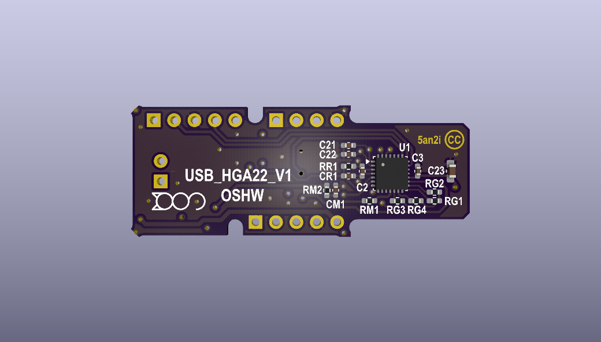
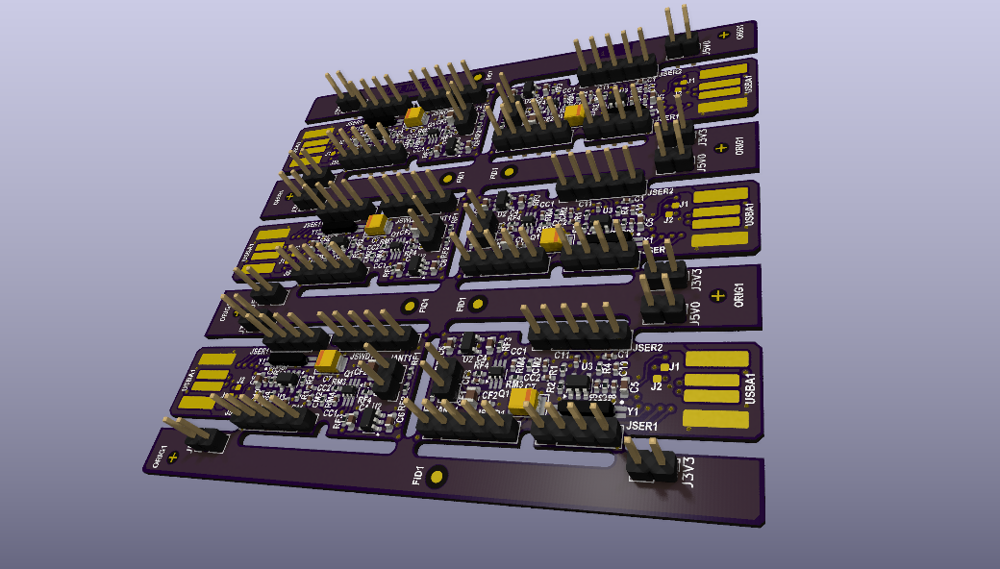

# Project Summary - USB_HGA22_V1

## English Description

### Overview
USB_HGA22_V1 is a hardware and software project designed to receive and process signals from the **HGA22** transmitter located in Lakihegy, Hungary. The HGA22 station operates at 135.6 kHz using FSK modulation as part of the EFR Teleswitch system. Unlike standard DCF77 receivers, HGA22 provides much faster time synchronization (every 10 seconds). This project interfaces the receiver with a computer via USB using a modern STM32C071 microcontroller.

### Technical Details
- Microcontroller: **STM32C071** (Arm Cortex-M0+, featuring crystal-less USB support).
- Signal Source: HGA22 (135.6 kHz, FSK modulation, 200 bps).
- Functionality: Decoding the EFR/Teleswitch protocol for precise time acquisition and power management command monitoring.
- Connection: USB 2.0 Full Speed (CDC or HID class) for direct PC integration.

### Key Features
- High-speed synchronization compared to traditional longwave time signals.
- Utilization of the internal 48 MHz RC oscillator (CRS) of the STM32C071 for crystal-less USB communication.
- Low-power design suitable for continuous background operation.

---

## Magyar nyelvű összefoglaló

### Áttekintés
Az USB_HGA22_V1 egy hardveres és szoftveres projekt, amelyet a lakihegyi **HGA22** adó jeleinek vételére és feldolgozására terveztek. A HGA22 állomás 135,6 kHz-es frekvencián, FSK modulációval sugároz az európai EFR Teleswitch rendszer részeként. A DCF77-tel ellentétben a HGA22 sokkal gyakoribb (10 másodpercenkénti) időszinkronizációt tesz lehetővé. A projekt egy modern STM32C071 mikrokontroller segítségével illeszti a vevőegységet a számítógéphez USB-n keresztül.

### Technikai részletek
- Mikrokontroller: **STM32C071** (Arm Cortex-M0+, integrált USB támogatással).
- Jelforrás: HGA22 (135,6 kHz, FSK moduláció, 200 bps adatsebesség).
- Funkció: Az EFR/Teleswitch protokoll dekódolása pontos időnyeréshez vagy vezérlési parancsok (pl. tarifaváltás) monitorozásához.
- Kapcsolat: USB 2.0 Full Speed interfész a közvetlen PC-s kapcsolathoz.

### Főbb jellemzők
- A hagyományos hosszúhullámú időjelekhez képest lényegesen gyorsabb szinkronizáció.
- Az STM32C071 belső 48 MHz-es oszcillátorának (CRS) használata, így nincs szükség külső kvarckristályra az USB kommunikációhoz.
- Alacsony fogyasztású kialakítás, amely ideális folyamatos háttérüzemre.

##Schematic

### Revision 1.0

## Visuals

### Top View

### Bottom View

### Panelized Board
